## 👋 Hi I'm [@Choimoe](https://github.com/Choimoe)

- 🔭 I’m currently studying in [SDU](https://www.sdu.edu.cn/)
- 🌱 I’m currently learning Computer Science
- 🧪 I’m currently researching **System4AI** and **AI4Storage**
- 📫 How to reach me: 
   - Mail: qwqshq@gmail.com

  <picture>
    
  </picture>

  <picture>
    
  </picture>

  <picture>
    
  </picture>

  <picture>
    
  </picture>

  <picture>
    
  </picture>

